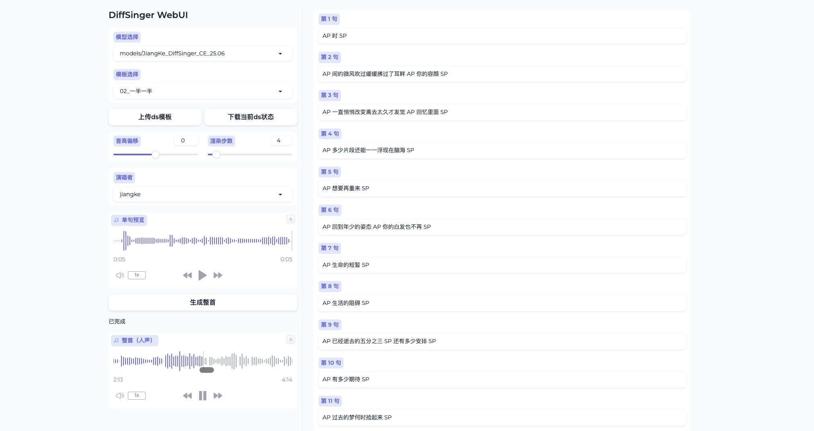

# DiffSinger WebUI

一个基于 Python 的 DiffSinger WebUI，支持模板驱动逐句渲染、整曲合成与 BGM 混音。
依赖 gradio 与 [diffsinger-utau](https://github.com/bingcheng1998/diffsinger_utau)。
基于 [diffsinger](https://github.com/openvpi/DiffSinger) 项目，兼容 OpenUtau 声库。

## 界面与操作

- 选择声库
- 选择模板
- 输入歌词
- 单句编辑后回车可以立即渲染并播放
- 点击合成整曲按钮可以合成整首歌曲



## 环境要求

> 由于[历史原因](https://github.com/openvpi/DiffSinger/blob/main/docs/GettingStarted.md#deployment)，强依赖 PyTorch 1.13，因此建议使用 Python 3.8。

- Python 3.8
- torch==1.13.1
- 其余依赖见 `requirements.txt`

## 安装
```bash
conda create -n diffsinger python=3.8
conda activate diffsinger
pip install -r requirements.txt
```

请确保您能成功安装与当前系统兼容的 `torch==1.13.1` 以及 `diffsinger-utau`。

### 下载声库

什么是声库？声库可以理解为歌唱者的模型，有着各自的音色等特性。

社区提供了[DiffSinger自制声库分享](https://docs.qq.com/sheet/DQXNDY0pPaEpOc3JN)，如果你不确定下载哪个，推荐从[zhibin club](https://www.zhibin.club/)下载[姜柯JiangKe](https://pan.quark.cn/s/254f030af8cb#/list/share/0929019064004907b7b95212c03066ed)声库开始尝试。

下载声库后，需要解压，解压缩后的路径可以作为程序参数进行推理。

## 目录结构
- `models/`：放置 DiffSinger 模型（详见 `models/README.md`）
- `templates/public/`：公开 ds 模板（可共建）
- `templates/user/`：用户上传 ds 模板（同名覆盖公开模板）
- `output/pred_all/`：缓存与最终输出

BGM：将与模板同名的音频（如 `song.ds` 与 `song.mp3`）放在同一目录可启用 BGM 开关。

## 启动
```bash
python app.py --host 0.0.0.0 --port 7860
```